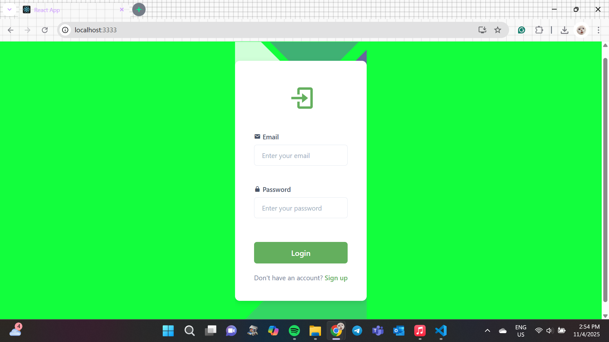
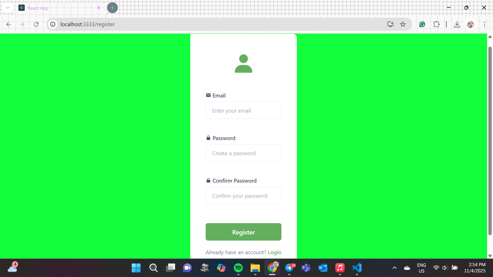

# Project React - Login & Registration Page

This project is a **Login and Registration Page** built using **React (TypeScript) and Create React App (CRA)**. It provides a simple and user-friendly authentication interface.

## Features
- User-friendly **Login & Registration** pages
- Uses **React with TypeScript**
- **React Router** for navigation between pages
- **Custom styling** with CSS (modify as needed)
- **Form validation** for input fields

## Installation & Setup
Follow these steps to set up and run the project:

### 1. Clone the Repository
```sh
git clone https://github.com/adlinmn/project-react.git
cd project-react
```

### 2. Install Dependencies
```sh
yarn install
```

### 3. Start the Development Server
Run the following command to start the app on **Port 3333**:
```sh
yarn start
```

If another service is using Port 3333, you may need to change the port in `package.json`.

## Project Structure
```
project-react/
│-- src/
│   │-- pages/
│   │   │-- LoginPage.tsx
│   │   │-- RegisterPage.tsx
│   │-- styles/
│   │   │-- style.css
│   │-- App.tsx
│   │-- main.tsx
│-- package.json
│-- README.md
```

## Deployment
To deploy the project on **GitHub Pages** or **Vercel**, follow their documentation.

## Screenshots
### Login Page:


### Registration Page:



